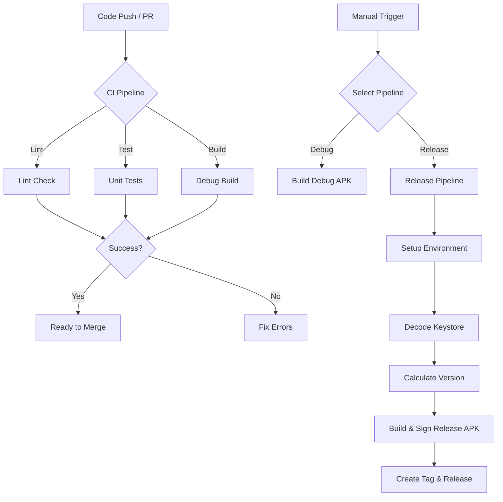

# Product Requirements Document: CI/CD Pipeline

## Overview
This document outlines the requirements for the enterprise-grade CI/CD pipeline for the Android project. The goal is to automate testing, building, and releasing to ensure code quality and efficient delivery.

## Requirements

### 1. Continuous Integration (CI)
*   **Trigger:** Pushes to `main`/`master` and all Pull Requests.
*   **Checks:**
    *   **Linting:** Code style and static analysis (Android Lint/Ktlint).
    *   **Unit Tests:** Execution of unit tests (`./gradlew test`).
    *   **Build Integrity:** Successful compilation of a Debug APK.

### 2. Manual Debug Build
*   **Trigger:** Manual dispatch via GitHub Actions interface.
*   **Output:** Debug APK artifact.
*   **Retention:** 7 days.

### 3. Release Pipeline
*   **Trigger:** Manual dispatch via GitHub Actions interface.
*   **Security:**
    *   Secure Keystore management using Base64 encoding in GitHub Secrets.
    *   No hardcoded secrets in the codebase.
*   **Versioning:**
    *   Semantic Versioning (SemVer) strategy.
    *   Automatic patch version increment (e.g., `1.0.0` -> `1.0.1`).
*   **Artifacts:**
    *   Signed Release APK.
    *   GitHub Release entry with the APK attached.
    *   Git Tag creation.

## Pipeline Flow

