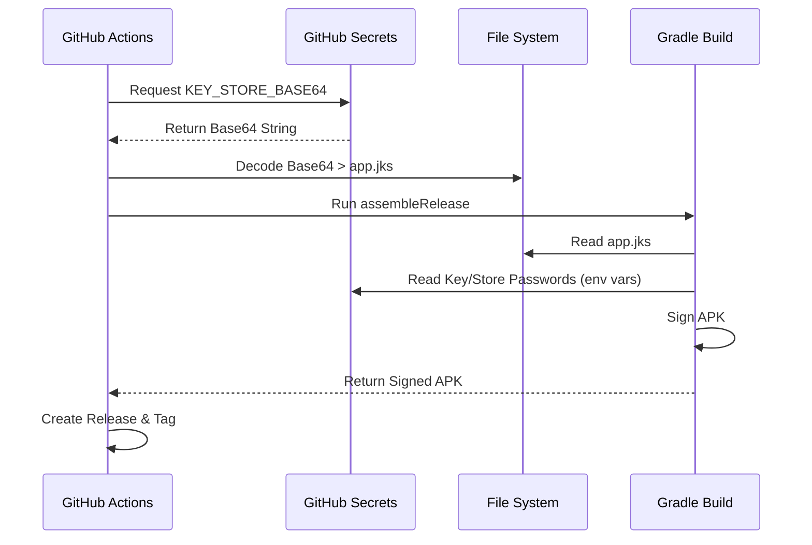

# Technical Design: CI/CD Architecture

## Architecture
The CI/CD pipeline is built using GitHub Actions. It leverages the Gradle build system for Android.

### Workflows
1.  **`ci.yml`**: Runs on every code change to ensure integrity.
2.  **`manual_debug.yml`**: Allows developers to generate debug builds on demand.
3.  **`release.yml`**: Automates the release process, including signing and versioning.

## Secret Management
To secure the signing keys, we use GitHub Actions Secrets. The Keystore file is encoded in Base64 and stored as a secret. During the build process, it is decoded into a temporary file.

### Required Secrets
*   `KEY_ALIAS`: The alias of the key in the store.
*   `KEY_PASSWORD`: The password for the key.
*   `KEY_STORE_PASSWORD`: The password for the keystore.
*   `KEY_STORE_BASE64`: The Base64 encoded content of the `.jks` file.

### Secret Generation
To generate the `KEY_STORE_BASE64` secret, run this PowerShell command:
```powershell
[Convert]::ToBase64String([IO.File]::ReadAllBytes('app-release.jks'))
```

## Semantic Versioning Strategy
The release pipeline automatically handles versioning:
1.  Fetch all Git tags.
2.  Parse the latest tag (e.g., `v1.2.3`).
3.  Increment the Patch version (e.g., `1.2.4`).
4.  If no tags exist, default to `1.0.0`.

## Signing Process Sequence


