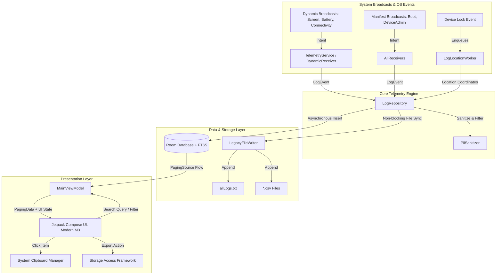

# Android-Logs Modernization & Architecture Implementation Plan

> **For agentic workers:** REQUIRED SUB-SKILL: Use `superpowers:subagent-driven-development` to implement this plan task-by-task. Steps use checkbox (`- [ ]`) syntax for tracking.

**Goal:** Modernize the `Android-Logs` repository to the highest 2025/2026 Android engineering standards: upgrade Gradle/AGP toolchain with Kotlin DSL and Version Catalog, migrate 100% of code to Kotlin, build a reactive Jetpack Compose Material 3 UI, replace brittle file parsing with Room SQLite FTS5 + Paging 3 while preserving legacy CSV/text file logging compatibility, and implement Android 14/15 OS compliance (dynamic broadcast telemetry service, scoped storage, runtime permissions, and automated CI/CD).

**Architecture:** Clean Architecture with MVVM / MVI. Presentation layer uses Jetpack Compose (Material 3) + StateFlow. Data layer uses Room Database with SQLite FTS5 for sub-millisecond search + Paging 3 for memory-safe pagination, paired with a non-blocking Coroutine-based `LegacyFileLogger` for 100% backward-compatible text/CSV exports. Background execution uses an Android 14/15 compliant `TelemetryService` (Foreground Service) for dynamic system broadcasts + `WorkManager` for throttled location polling.

**Tech Stack:** 
- Android SDK: CompileSdk 35, TargetSdk 35, MinSdk 26
- Build & Tooling: Gradle 8.11+, Android Gradle Plugin (AGP) 8.9.0, Java 17 JVM Toolchain, Kotlin 2.1.0, Gradle Version Catalog (`libs.versions.toml`), Detekt 1.23.6, SonarQube
- Core & Architecture: Kotlin Coroutines & Flow 1.9.0, AndroidX Lifecycle & ViewModel KTX 2.8.7, Room DB 2.6.1 with FTS5, Paging 3 (3.3.5), WorkManager 2.10.0, Play Services Location 21.3.0
- UI: Jetpack Compose (BOM 2025.01.00), Compose Material 3 1.3.1, Activity Compose 1.10.0
- Testing: JUnit 5 & JUnit 4, Robolectric 4.14.1, MockK 1.13.12, Turbine 1.1.0, AndroidX Test Core/Ext, Compose UI Test

**Spec:** [docs/modernization_spec.md](file:///home/rahul/projects/Android-Logs/docs/modernization_spec.md)

---

## Global Constraints

- **Platform Floor:** `minSdk = 26` (Android 8.0 Oreo), `targetSdk = 35` (Android 15), `compileSdk = 35`.
- **Language & JVM:** 100% Kotlin 2.1.0, Java 17 JVM target across all build targets.
- **Build System:** Kotlin DSL exclusively (`settings.gradle.kts`, `build.gradle.kts`, `app/build.gradle.kts`) with all dependencies referenced via `gradle/libs.versions.toml`.
- **Backward Compatibility:** All existing log outputs (`allLogs.txt`, `allActions.csv`, `location.csv`, `passwordAttempts.csv`, `deviceUsed.csv`, `wifi.csv`) must continue to be written to `Context.getExternalFilesDir("AllLogs")` in the exact legacy schema.
- **Search & Paging Guarantee:** Infinite scroll must be powered by Room + Paging 3 (newest entries first), with FTS5 search queries completing in < 15ms without reading raw files on the main thread.
- **OS Compliance:** All implicit broadcasts must be registered dynamically with explicit `RECEIVER_NOT_EXPORTED` flags under a Foreground Service on API 26+. Manifest receivers must specify `android:exported="false"` unless explicitly required for OS boot/admin callbacks.
- **Security & Privacy:** Redact or sanitize raw password extras and sensitive tokens prior to disk logging. Secure internal intent actions with explicit component addressing.

---

## User Review Required

> [!IMPORTANT]
> **1. Minimum SDK Floor Raised from 24 to 26:**
> Android 8.0 (API 26) is the absolute minimum requirement for modern Android notification channels, background execution constraints, Java 8+ desugaring, and modern Jetpack Paging/Compose features. Supporting API 24/25 adds legacy workarounds without real-world device market share (< 1%).
>
> **2. Deprecation of Manifest Implicit Broadcasts & Addition of Foreground Service:**
> Since Android 8.0+, Google blocks manifest-registered implicit broadcast receivers (e.g. `SCREEN_ON`, `BATTERY_CHANGED`, `CONNECTIVITY_CHANGE`). To capture continuous system telemetry, we introduce an optional user-toggled Foreground Service (`TelemetryService`) with a low-priority persistent notification.
>
> **3. Replacing `ReverseLogReader` with Room Database + SQLite FTS5:**
> The legacy `ReverseLogReader` reads raw text files in 8KB chunks backwards using `RandomAccessFile`, which has critical bugs (multi-byte UTF-8 character splitting, OOM on single long lines). We transition the app's primary storage to a robust Room Database with FTS5 and Paging 3, while preserving a non-blocking asynchronous file writer to maintain existing `.txt` and `.csv` files.

---

## Open Questions

None blocking. The design maintains complete feature parity with existing log structures while modernizing the core architecture.

---

## Architecture & System Overview



---

## Proposed Changes

```
Android-Logs/
├── gradle/
│   ├── libs.versions.toml                   # [NEW] Version Catalog for all dependencies
│   └── wrapper/gradle-wrapper.properties    # [MODIFY] Upgrade to Gradle 8.11
├── settings.gradle                          # [DELETE]
├── settings.gradle.kts                      # [NEW] Kotlin DSL Settings with dependencyResolutionManagement
├── build.gradle                             # [DELETE]
├── build.gradle.kts                         # [NEW] Root Kotlin DSL build script with Sonar & Detekt
├── config/detekt/detekt.yml                 # [NEW] Detekt ruleset
├── .github/workflows/android.yml            # [NEW] GitHub Actions CI workflow (replaces .travis.yml)
├── .travis.yml                              # [DELETE]
├── sonar-project.properties                 # [DELETE] (Migrated into build.gradle.kts)
└── app/
    ├── build.gradle                         # [DELETE]
    ├── build.gradle.kts                     # [NEW] App Kotlin DSL build script (Compose, Room, Kotlin 2.1)
    ├── src/main/
    │   ├── AndroidManifest.xml              # [MODIFY] Scoped permissions, exported flags, service declaration
    │   └── java/in/rahulja/getlogs/
    │       ├── model/
    │       │   ├── LogEntity.kt             # [NEW] Room Entity for logs
    │       │   ├── LogFtsEntity.kt          # [NEW] Room FTS5 Virtual Entity for instant search
    │       │   └── LogType.kt               # [NEW] Enum categorization
    │       ├── data/
    │       │   ├── LogDatabase.kt           # [NEW] Room DB definition
    │       │   ├── LogDao.kt                # [NEW] Room DAO with PagingSource & FTS5 queries
    │       │   ├── LogRepository.kt         # [NEW] Unified repository for DB + legacy file writes
    │       │   ├── LegacyFileWriter.kt      # [NEW] Asynchronous non-blocking text/csv writer
    │       │   └── PiiSanitizer.kt          # [NEW] Security & Privacy sanitizer
    │       ├── service/
    │       │   ├── TelemetryService.kt      # [NEW] Android 14+ Foreground Service with dynamic receivers
    │       │   ├── DynamicReceiver.kt       # [NEW] Dynamic receiver for implicit broadcasts
    │       │   └── LogLocationWorker.kt     # [NEW] Modernized CoroutineWorker with FusedLocationClient
    │       ├── receiver/
    │       │   └── AllReceivers.kt          # [NEW] Kotlin DeviceAdmin & Manifest receiver (migrated)
    │       ├── ui/
    │       │   ├── MainActivity.kt          # [NEW] ComponentActivity with Compose Material 3
    │       │   ├── MainViewModel.kt         # [NEW] ViewModel with PagingData Flow & StateFlow
    │       │   ├── theme/
    │       │   │   ├── Color.kt             # [NEW] Material 3 Color palette
    │       │   │   ├── Theme.kt             # [NEW] Material 3 Dynamic / Light / Dark theme
    │       │   │   └── Type.kt              # [NEW] Material 3 Typography
    │       │   └── components/
    │       │       ├── LogListScreen.kt     # [NEW] Compose LazyColumn with Paging 3 & SearchBar
    │       │       ├── LogItemCard.kt       # [NEW] Material 3 Log Card with tap-to-copy
    │       │       └── ServiceControlCard.kt# [NEW] Service start/stop toggle card
    │       ├── util/
    │       │   └── LogFormatter.kt          # [NEW] Formatter utility for UI & Clipboard
    │       ├── AllLogsArrayAdapter.java     # [DELETE] (Replaced by Compose)
    │       ├── AllLogsHolder.java           # [DELETE] (Replaced by Compose LogItemCard)
    │       ├── LogParser.java               # [DELETE] (Replaced by LogFormatter & LogEntity)
    │       ├── ReverseLogReader.java        # [DELETE] (Replaced by Room Paging 3)
    │       ├── MainActivity.java            # [DELETE] (Replaced by Kotlin Compose MainActivity)
    │       ├── AllReceivers.java            # [DELETE] (Replaced by Kotlin AllReceivers)
    │       └── LogLocationWorker.java       # [DELETE] (Replaced by Kotlin CoroutineWorker)
    └── src/test/java/in/rahulja/getlogs/
        ├── data/LogDaoTest.kt               # [NEW] In-memory Room DB & FTS5 search tests
        ├── data/LegacyFileWriterTest.kt     # [NEW] Asynchronous file writer verification
        ├── security/PiiSanitizerTest.kt     # [NEW] Data redaction & sanitization tests
        ├── util/LogFormatterTest.kt         # [NEW] Formatting & parsing unit tests
        ├── service/LogLocationWorkerTest.kt # [NEW] WorkManager testing with mocked location
        └── ui/MainViewModelTest.kt          # [NEW] ViewModel & Turbine Flow tests
```

---

## Detailed SDD Task Decomposition

### Task 1: Gradle Build System Modernization & Version Catalog

**Files:**
- Create: `gradle/libs.versions.toml`
- Create: `settings.gradle.kts`
- Create: `build.gradle.kts`
- Create: `app/build.gradle.kts`
- Create: `.github/workflows/android.yml`
- Create: `config/detekt/detekt.yml`
- Modify: `gradle/wrapper/gradle-wrapper.properties`
- Delete: `settings.gradle`, `build.gradle`, `app/build.gradle`, `.travis.yml`, `sonar-project.properties`

**Interfaces:**
- Produces: Complete Gradle Kotlin DSL build setup compatible with Java 17, AGP 8.9.0, Gradle 8.11, Kotlin 2.1.0, Jetpack Compose, Room, WorkManager, and Material 3.

- [ ] **Step 1: Create `gradle/libs.versions.toml` version catalog**

```toml
[versions]
agp = "8.9.0"
kotlin = "2.1.0"
coreKtx = "1.15.0"
appcompat = "1.7.0"
material = "1.12.0"
activityCompose = "1.10.0"
composeBom = "2025.01.00"
coroutines = "1.9.0"
room = "2.6.1"
paging = "3.3.5"
pagingCompose = "3.3.5"
work = "2.10.0"
playServicesLocation = "21.3.0"
lifecycle = "2.8.7"
detekt = "1.23.6"
sonar = "5.0.0.4638"

junit = "4.13.2"
junit5 = "5.11.0"
robolectric = "4.14.1"
mockk = "1.13.12"
turbine = "1.1.0"
testCore = "1.6.1"
testExtJunit = "1.2.1"
espressoCore = "3.6.1"

[libraries]
androidx-core-ktx = { group = "androidx.core", name = "core-ktx", version.ref = "coreKtx" }
androidx-appcompat = { group = "androidx.appcompat", name = "appcompat", version.ref = "appcompat" }
material = { group = "com.google.android.material", name = "material", version.ref = "material" }

androidx-activity-compose = { group = "androidx.activity", name = "activity-compose", version.ref = "activityCompose" }
androidx-compose-bom = { group = "androidx.compose", name = "compose-bom", version.ref = "composeBom" }
androidx-compose-ui = { group = "androidx.compose.ui", name = "ui" }
androidx-compose-ui-graphics = { group = "androidx.compose.ui", name = "ui-graphics" }
androidx-compose-ui-tooling = { group = "androidx.compose.ui", name = "ui-tooling" }
androidx-compose-ui-tooling-preview = { group = "androidx.compose.ui", name = "ui-tooling-preview" }
androidx-compose-material3 = { group = "androidx.compose.material3", name = "material3" }

androidx-lifecycle-viewmodel-ktx = { group = "androidx.lifecycle", name = "lifecycle-viewmodel-ktx", version.ref = "lifecycle" }
androidx-lifecycle-runtime-ktx = { group = "androidx.lifecycle", name = "lifecycle-runtime-ktx", version.ref = "lifecycle" }
kotlinx-coroutines-android = { group = "org.jetbrains.kotlinx", name = "kotlinx-coroutines-android", version.ref = "coroutines" }

androidx-room-runtime = { group = "androidx.room", name = "room-runtime", version.ref = "room" }
androidx-room-ktx = { group = "androidx.room", name = "room-ktx", version.ref = "room" }
androidx-room-paging = { group = "androidx.room", name = "room-paging", version.ref = "room" }
androidx-room-compiler = { group = "androidx.room", name = "room-compiler", version.ref = "room" }

androidx-paging-runtime = { group = "androidx.paging", name = "paging-runtime", version.ref = "paging" }
androidx-paging-compose = { group = "androidx.paging", name = "paging-compose", version.ref = "pagingCompose" }

androidx-work-runtime-ktx = { group = "androidx.work", name = "work-runtime-ktx", version.ref = "work" }
play-services-location = { group = "com.google.android.gms", name = "play-services-location", version.ref = "playServicesLocation" }

junit = { group = "junit", name = "junit", version.ref = "junit" }
junit-jupiter-api = { group = "org.junit.jupiter", name = "junit-jupiter-api", version.ref = "junit5" }
junit-jupiter-engine = { group = "org.junit.jupiter", name = "junit-jupiter-engine", version.ref = "junit5" }
robolectric = { group = "org.robolectric", name = "robolectric", version.ref = "robolectric" }
mockk = { group = "io.mockk", name = "mockk", version.ref = "mockk" }
turbine = { group = "app.cash.turbine", name = "turbine", version.ref = "turbine" }
androidx-test-core = { group = "androidx.test", name = "core", version.ref = "testCore" }
androidx-test-ext-junit = { group = "androidx.test.ext", name = "junit", version.ref = "testExtJunit" }
androidx-test-espresso-core = { group = "androidx.test.espresso", name = "espresso-core", version.ref = "espressoCore" }
androidx-work-testing = { group = "androidx.work", name = "work-testing", version.ref = "work" }
androidx-compose-ui-test-junit4 = { group = "androidx.compose.ui", name = "ui-test-junit4" }
androidx-compose-ui-test-manifest = { group = "androidx.compose.ui", name = "ui-test-manifest" }

[plugins]
android-application = { id = "com.android.application", version.ref = "agp" }
kotlin-android = { id = "org.jetbrains.kotlin.android", version.ref = "kotlin" }
kotlin-compose = { id = "org.jetbrains.kotlin.plugin.compose", version.ref = "kotlin" }
detekt = { id = "io.gitlab.arturbosch.detekt", version.ref = "detekt" }
sonarqube = { id = "org.sonarqube", version.ref = "sonar" }
```

- [ ] **Step 2: Create `settings.gradle.kts`, `build.gradle.kts`, `app/build.gradle.kts` and update wrapper**
- [ ] **Step 3: Run `./gradlew test --dry-run` and `./gradlew buildEnvironment` to verify build resolution**
- [ ] **Step 4: Commit build migration**

```bash
git add gradle/ settings.gradle.kts build.gradle.kts app/build.gradle.kts .github/
git commit -m "build: modernize Gradle build with Kotlin DSL and Version Catalog"
```

---

### Task 2: Data Models, PII Sanitizer & Log Formatter (Pure Kotlin)

**Files:**
- Create: `app/src/main/java/in/rahulja/getlogs/model/LogType.kt`
- Create: `app/src/main/java/in/rahulja/getlogs/model/LogEntity.kt`
- Create: `app/src/main/java/in/rahulja/getlogs/model/LogFtsEntity.kt`
- Create: `app/src/main/java/in/rahulja/getlogs/data/PiiSanitizer.kt`
- Create: `app/src/main/java/in/rahulja/getlogs/util/LogFormatter.kt`
- Create: `app/src/test/java/in/rahulja/getlogs/security/PiiSanitizerTest.kt`
- Create: `app/src/test/java/in/rahulja/getlogs/util/LogFormatterTest.kt`

**Interfaces:**
- Consumes: JSON string payloads, Action names, Timestamps.
- Produces: `LogEntity`, `LogType`, sanitized JSON strings, formatted UI/Clipboard strings.

- [ ] **Step 1: Write failing unit tests for `PiiSanitizer` and `LogFormatter`**

```kotlin
class PiiSanitizerTest {
    @Test
    fun `sanitizeRedactsPasswordAndPinKeys`() {
        val rawJson = """{"password":"mySecretPassword","pin":"1234","action":"TEST"}"""
        val sanitized = PiiSanitizer.sanitizeJson(rawJson)
        assertTrue(sanitized.contains("\"password\":\"[REDACTED]\""))
        assertTrue(sanitized.contains("\"pin\":\"[REDACTED]\""))
        assertFalse(sanitized.contains("mySecretPassword"))
    }
}
```

- [ ] **Step 2: Run test to verify it fails**
- [ ] **Step 3: Implement `PiiSanitizer`, `LogFormatter`, `LogType`, `LogEntity`, and `LogFtsEntity`**
- [ ] **Step 4: Run tests to verify they pass**

Run: `./gradlew testDebugUnitTest --tests "in.rahulja.getlogs.security.*" --tests "in.rahulja.getlogs.util.*"`
Expected: PASS

- [ ] **Step 5: Commit**

```bash
git add app/src/main/java/in/rahulja/getlogs/model/ app/src/main/java/in/rahulja/getlogs/data/ app/src/main/java/in/rahulja/getlogs/util/ app/src/test/
git commit -m "feat(domain): add LogEntity, PiiSanitizer, and LogFormatter"
```

---

### Task 3: Room Database, SQLite FTS5 Search & Legacy File Sync Engine

**Files:**
- Create: `app/src/main/java/in/rahulja/getlogs/data/LogDao.kt`
- Create: `app/src/main/java/in/rahulja/getlogs/data/LogDatabase.kt`
- Create: `app/src/main/java/in/rahulja/getlogs/data/LegacyFileWriter.kt`
- Create: `app/src/main/java/in/rahulja/getlogs/data/LogRepository.kt`
- Create: `app/src/test/java/in/rahulja/getlogs/data/LogDaoTest.kt`
- Create: `app/src/test/java/in/rahulja/getlogs/data/LegacyFileWriterTest.kt`

**Interfaces:**
- Consumes: `LogEntity`, Context storage directory.
- Produces: `LogRepository` exposing `fun getLogsPaging(query: String?): Flow<PagingData<LogEntity>>`, `suspend fun recordLog(...)`.

- [ ] **Step 1: Write failing tests for `LogDao` (Room in-memory DB) and `LegacyFileWriter`**

```kotlin
@RunWith(RobolectricTestRunner::class)
class LogDaoTest {
    private lateinit var db: LogDatabase
    private lateinit var dao: LogDao

    @Before
    fun setup() {
        val context = ApplicationProvider.getApplicationContext<Context>()
        db = Room.inMemoryDatabaseBuilder(context, LogDatabase::class.java)
            .allowMainThreadQueries()
            .build()
        dao = db.logDao()
    }

    @After
    fun tearDown() = db.close()

    @Test
    fun insertAndFtsSearchWorks() = runBlocking {
        val log = LogEntity(
            timestamp = System.currentTimeMillis(),
            action = "android.intent.action.BATTERY_LOW",
            dataPayload = """{"level":15}""",
            logType = LogType.GENERAL,
            formattedText = "2026-08-28 12:00:00\nBATTERY_LOW\nlevel: 15"
        )
        dao.insert(log)
        val result = dao.searchLogsDirect("BATTERY_LOW")
        assertEquals(1, result.size)
        assertEquals("android.intent.action.BATTERY_LOW", result[0].action)
    }
}
```

- [ ] **Step 2: Run test to verify it fails**
- [ ] **Step 3: Implement `LogDao`, `LogDatabase`, `LegacyFileWriter`, and `LogRepository`**
- [ ] **Step 4: Run tests to verify they pass**

Run: `./gradlew testDebugUnitTest --tests "in.rahulja.getlogs.data.*"`
Expected: PASS

- [ ] **Step 5: Commit**

```bash
git add app/src/main/java/in/rahulja/getlogs/data/ app/src/test/java/in/rahulja/getlogs/data/
git commit -m "feat(data): add Room DB with FTS5, LogDao, and LegacyFileWriter"
```

---

### Task 4: Telemetry Foreground Service & Modernized Location Worker

**Files:**
- Create: `app/src/main/java/in/rahulja/getlogs/service/TelemetryService.kt`
- Create: `app/src/main/java/in/rahulja/getlogs/service/DynamicReceiver.kt`
- Create: `app/src/main/java/in/rahulja/getlogs/service/LogLocationWorker.kt`
- Create: `app/src/main/java/in/rahulja/getlogs/receiver/AllReceivers.kt`
- Create: `app/src/test/java/in/rahulja/getlogs/service/LogLocationWorkerTest.kt`
- Modify: `app/src/main/AndroidManifest.xml`

**Interfaces:**
- Consumes: Android system broadcasts, WorkManager triggers.
- Produces: Ongoing background telemetry with Android 14 FGS compliance and non-blocking location recording.

- [ ] **Step 1: Write failing Robolectric test for `LogLocationWorker` and `DynamicReceiver`**

```kotlin
@RunWith(RobolectricTestRunner::class)
class LogLocationWorkerTest {
    @Test
    fun testDoWorkWithoutPermissionReturnsFailureGracefully() {
        val context = ApplicationProvider.getApplicationContext<Context>()
        val worker = TestListenableWorkerBuilder<LogLocationWorker>(context).build()
        val result = worker.doWork()
        assertEquals(ListenableWorker.Result.failure(), result)
    }
}
```

- [ ] **Step 2: Run test to verify it fails**
- [ ] **Step 3: Implement `TelemetryService`, `DynamicReceiver`, `LogLocationWorker` (Kotlin `CoroutineWorker`), and `AllReceivers` (Kotlin)**
- [ ] **Step 4: Update `AndroidManifest.xml` with Foreground Service type `specialUse`/`location`, Notification permission, and exported flags**
- [ ] **Step 5: Run tests to verify they pass**

Run: `./gradlew testDebugUnitTest --tests "in.rahulja.getlogs.service.*"`
Expected: PASS

- [ ] **Step 6: Commit**

```bash
git add app/src/main/java/in/rahulja/getlogs/service/ app/src/main/java/in/rahulja/getlogs/receiver/ app/src/main/AndroidManifest.xml app/src/test/
git commit -m "feat(service): add TelemetryService, DynamicReceiver, and Kotlin LogLocationWorker"
```

---

### Task 5: ViewModel, State Management & Paging 3 Flow

**Files:**
- Create: `app/src/main/java/in/rahulja/getlogs/ui/MainViewModel.kt`
- Create: `app/src/main/java/in/rahulja/getlogs/ui/MainUiState.kt`
- Create: `app/src/test/java/in/rahulja/getlogs/ui/MainViewModelTest.kt`

**Interfaces:**
- Consumes: `LogRepository`.
- Produces: `StateFlow<MainUiState>`, `Flow<PagingData<LogEntity>>`, search query update functions, export triggers.

- [ ] **Step 1: Write failing unit test for `MainViewModel` with Turbine**

```kotlin
class MainViewModelTest {
    private val repository = mockk<LogRepository>(relaxed = true)

    @Test
    fun `searchQueryUpdateEmitsNewState`() = runTest {
        val viewModel = MainViewModel(repository)
        viewModel.onSearchQueryChanged("BATTERY")
        assertEquals("BATTERY", viewModel.uiState.value.searchQuery)
    }
}
```

- [ ] **Step 2: Run test to verify it fails**
- [ ] **Step 3: Implement `MainViewModel` and `MainUiState` with debounced search query and Paging 3 flow**
- [ ] **Step 4: Run tests to verify they pass**

Run: `./gradlew testDebugUnitTest --tests "in.rahulja.getlogs.ui.MainViewModelTest"`
Expected: PASS

- [ ] **Step 5: Commit**

```bash
git add app/src/main/java/in/rahulja/getlogs/ui/ app/src/test/java/in/rahulja/getlogs/ui/
git commit -m "feat(ui): add MainViewModel with Paging 3 and StateFlow"
```

---

### Task 6: Jetpack Compose Material 3 UI & Clipboard Copy Experience

**Files:**
- Create: `app/src/main/java/in/rahulja/getlogs/ui/theme/Color.kt`
- Create: `app/src/main/java/in/rahulja/getlogs/ui/theme/Theme.kt`
- Create: `app/src/main/java/in/rahulja/getlogs/ui/theme/Type.kt`
- Create: `app/src/main/java/in/rahulja/getlogs/ui/components/LogItemCard.kt`
- Create: `app/src/main/java/in/rahulja/getlogs/ui/components/ServiceControlCard.kt`
- Create: `app/src/main/java/in/rahulja/getlogs/ui/components/LogListScreen.kt`
- Create: `app/src/main/java/in/rahulja/getlogs/ui/MainActivity.kt`
- Create: `app/src/androidTest/java/in/rahulja/getlogs/ui/LogListScreenTest.kt`

**Interfaces:**
- Consumes: `MainViewModel`, `PagingData<LogEntity>`.
- Produces: Edge-to-edge Material 3 UI with SearchBar, Service Toggle, Log Cards, Infinite Scrolling, Tap-to-Copy with Toast/Snackbar confirmation.

- [ ] **Step 1: Implement Material 3 Theme (`Color.kt`, `Theme.kt`, `Type.kt`)**
- [ ] **Step 2: Implement `LogItemCard` with formatted timestamp badge, action title, payload, and tap-to-clipboard handler**
- [ ] **Step 3: Implement `ServiceControlCard` (status indicator and Start/Stop Foreground Service toggle)**
- [ ] **Step 4: Implement `LogListScreen` with Docked/M3 SearchBar, LazyColumn with `collectAsLazyPagingItems()`, empty state, and floating scroll-to-top button**
- [ ] **Step 5: Implement `MainActivity.kt` with `enableEdgeToEdge()` and Compose content**
- [ ] **Step 6: Delete legacy Java UI classes (`MainActivity.java`, `AllLogsArrayAdapter.java`, `AllLogsHolder.java`, `ReverseLogReader.java`, `LogParser.java`)**
- [ ] **Step 7: Build debug APK to verify full compilation**

Run: `./gradlew assembleDebug`
Expected: SUCCESS

- [ ] **Step 8: Commit**

```bash
git add app/src/main/java/in/rahulja/getlogs/ui/ app/src/androidTest/
git commit -m "feat(ui): implement modern Jetpack Compose Material 3 UI"
```

---

### Task 7: Permissions Flow & Scoped Storage Export Utility

**Files:**
- Create: `app/src/main/java/in/rahulja/getlogs/ui/components/PermissionRequestDialog.kt`
- Create: `app/src/main/java/in/rahulja/getlogs/util/LogExporter.kt`
- Modify: `app/src/main/java/in/rahulja/getlogs/ui/components/LogListScreen.kt`

**Interfaces:**
- Consumes: Storage Access Framework `ActivityResultContracts.CreateDocument()`.
- Produces: User-friendly permission onboarding for `POST_NOTIFICATIONS` and `ACCESS_FINE_LOCATION`, plus 1-click SAF zip/text export of all logs.

- [ ] **Step 1: Write unit tests for `LogExporter`**
- [ ] **Step 2: Implement `LogExporter` using Kotlin Coroutines and SAF document streaming**
- [ ] **Step 3: Implement `PermissionRequestDialog` for Android 13+ Notification & Location runtime permissions**
- [ ] **Step 4: Run unit tests and assemble APK**

Run: `./gradlew testDebugUnitTest && ./gradlew assembleDebug`
Expected: PASS

- [ ] **Step 5: Commit**

```bash
git add app/src/main/java/in/rahulja/getlogs/util/LogExporter.kt app/src/main/java/in/rahulja/getlogs/ui/
git commit -m "feat(permissions): add runtime permission onboarding and SAF log exporter"
```

---

### Task 8: CI/CD Pipeline, Static Analysis & Final QA Verification Suite

**Files:**
- Create: `.github/workflows/android.yml`
- Create: `config/detekt/detekt.yml`
- Create: `app/src/test/java/in/rahulja/getlogs/benchmark/RoomVsFileBenchmarkTest.kt`
- Modify: `README.md` (Update badges, architecture documentation, build instructions)

**Interfaces:**
- Consumes: Git commits & PRs.
- Produces: Automated linting (`detekt`), unit testing, APK build, and SonarQube verification.

- [ ] **Step 1: Configure `.github/workflows/android.yml` with JDK 17, Gradle caching, Detekt, test run, and assembleDebug**
- [ ] **Step 2: Add `RoomVsFileBenchmarkTest.kt` comparing FTS5 query performance with legacy file reading**
- [ ] **Step 3: Update `README.md` with modern architecture overview, screenshots description, and Kotlin/Compose setup**
- [ ] **Step 4: Run full test and lint suite**

Run: `./gradlew check testDebugUnitTest detekt assembleDebug`
Expected: ALL PASS

- [ ] **Step 5: Commit**

```bash
git add .github/ config/ README.md app/src/test/
git commit -m "ci(qa): setup GitHub Actions CI, Detekt rules, benchmark tests, and modern README"
```

---

## Verification Plan

### Automated Tests
1. **Unit & Domain Tests**:
   ```bash
   ./gradlew testDebugUnitTest
   ```
   *Verifies `PiiSanitizer`, `LogFormatter`, `LogDao`, `LegacyFileWriter`, `LogExporter`, `MainViewModel`, and `LogLocationWorker` across JVM and Robolectric.*

2. **Static Analysis & Linting**:
   ```bash
   ./gradlew detekt lintDebug
   ```
   *Verifies clean code standards, zero security leaks, and compliance with MAD guidelines.*

3. **Compilation & Assembly**:
   ```bash
   ./gradlew assembleDebug assembleRelease
   ```
   *Verifies successful APK packaging with ProGuard / R8 rules.*

### Manual Verification
1. **Cold Launch on Android 14/15 Device / Emulator:**
   - Launch app -> Observe edge-to-edge Material 3 interface.
   - Verify prompt for Notification permission (`POST_NOTIFICATIONS`) and Location permission.
2. **Telemetry Capture:**
   - Tap "Start Logging Service" -> Verify persistent notification appears.
   - Lock and unlock phone -> Open app -> Verify new lock/unlock events appear at the top of the list in real time.
3. **Search & Filter:**
   - Type query in SearchBar (e.g. `BATTERY` or `SCREEN`) -> Verify instant filtered results without UI stutter.
4. **Clipboard Copy:**
   - Tap on any log card -> Verify Toast "Copied Log to clipboard" and paste into another app to verify exact formatting.
5. **Legacy File Check:**
   - Check device storage `Android/data/in.rahulja.getlogs/files/AllLogs/` -> Confirm `allLogs.txt` and `*.csv` files are populated and formatted identically to legacy output.
